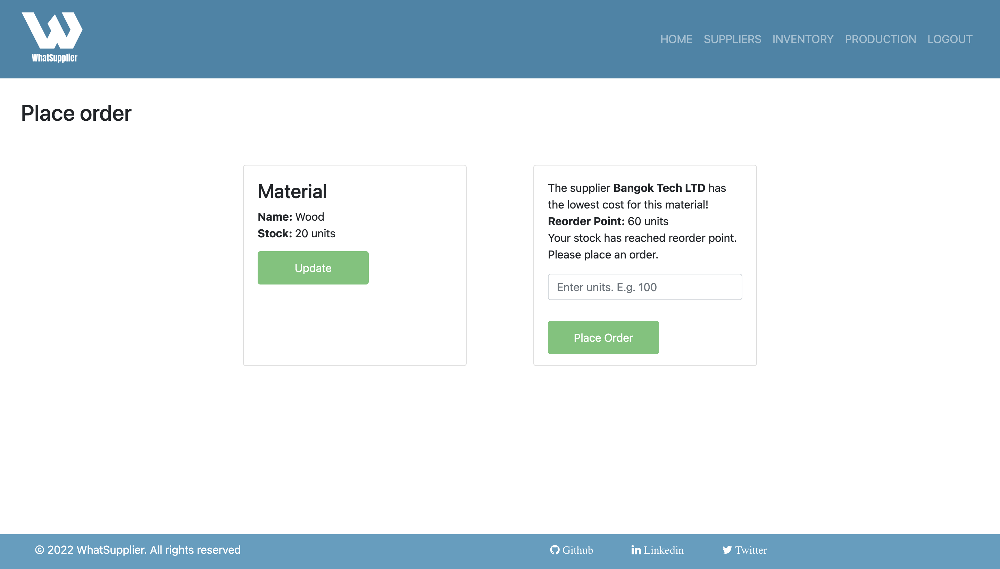
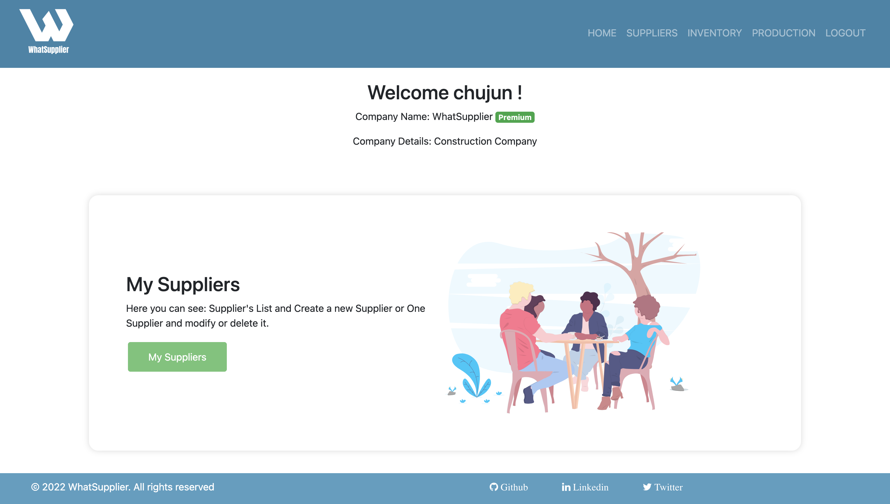

# **WhatSupplier - MERN Stack Single-Page Application**

## **Table of Contents** 

- [**WhatSupplier - MERN Stack Single-Page Application**](#whatsupplier---mern-stack-single-page-application)
  - [**Table of Contents**](#table-of-contents)
  - [**Description**](#description)
    - [**User Story:**](#user-story)
    - [**Wireframes:**](#wireframes)
  - [**Installation**](#installation)
  - [**Technologies Used**](#technologies-used)
  - [**Preview**](#preview)
  - [**Testing with Stripe**](#testing-with-stripe)
  - [**Deployed link**](#deployed-link)
  - [**Future Development**](#future-development)
  - [**Questions**](#questions)


## **Description**

Project idea by: [Marcela Mejia](https://github.com/marcelamejiao)

This project provides a tool for organizing and optimizing the process of ordering, storing, and using a company’s inventory. Also this application selects the supplier with the lowest cost based on a specific material.

In the Supply Chain process the factory purchases the materials from diverse suppliers. Using WhatSupplier the manager can choose the best offer in price when placing  an order. 

* WhatSupplier uses a function to decide which supplier offers the lowest cost to place an order. 

* WhatSupplier uses a function to determine when an order needs to be placed because stocks are running too low. This function is called ROP “Reorder Point’.
 
> What is a Reorder Point? 
>
> Order Point (aka Reorder Point) is a key concept within Inventory Management. Order too soon and financials will suffer as too much money is invested in inventory and you may not have enough space to store the inventory. 
Order too late and you may run out of inventory resulting in waste in the form of stock outs and poor customer service.
> 
> Order Point formula is:
> 
> Anticipated Demand (D) x Lead Time (L) + Safety Stock (SS) 
Ref: https://apicsdotcoach.wordpress.com/2017/02/18/order-point/

* Sending Materials to production: 
When the user sends an amount of raw materials to production the total amount of this material will decrease. If it is time to place a new order a display notification is shown on screen to proceed with the reorder process.

### **User Story:**
  AS A manager in a Supplier/Inventory area,

  I WANT to choose the cheapest supplier and  supervise the stocks by placing material orders on time,

  SO THAT I can effectively provide the stocks to the production area and optimize the supply chain process in the company.

### **Wireframes:**
 To see the wireframes and aditional information about the project planning: [click here!](https://docs.google.com/document/d/1GMc3-rKcXWFA2Aj1BXcAQgLNudQANhHkr_l39hxE-J4/edit#heading=h.yyrhu7ml5bea)


## **Installation**

```
npm install
```

```
npm run develop
```

## **Technologies Used**

* React
* GraphQL
  * Apollo
* HTML
* Styled Components
* CSS
* Bootstrap
* Javascript
* Node.js
* Express.js
* JSON Web Tokens (JWT)
* NoSQL
  * Mongoose
  * Mongo
* Bcrypt
* Stripe
* Heroku (previously hosted on heroku)

## **Preview**
 
 
 
 


## **Testing with Stripe**

When testing the payment system (Stripe) please use one of the credit cards found [here.](https://stripe.com/docs/testing?numbers-or-method-or-token=card-numbers#visa)

## **Deployed link**

💡 Live version: [click here!](https://whatsupplier.apps.marcelamejia.xyz/)

## **Future Development**

* Include final products and production area extension. Joining materials quantity to create a final product, including production times and costs. 
* Statistics graphics of materials usage, costs and suppliers preferences.
* Develop an ordering system to place an order with suppliers. Update inventory when order arrives from the Supplier. 
* Edit my profile page with company information. 
* Include material component, when the user can create new materials. 


## **Questions**

* Contact us on our GitHub profiles: [Marcela's GitHub](https://github.com/marcelamejiao) - [Chujun's GitHub](https://github.com/dorisliu333)
